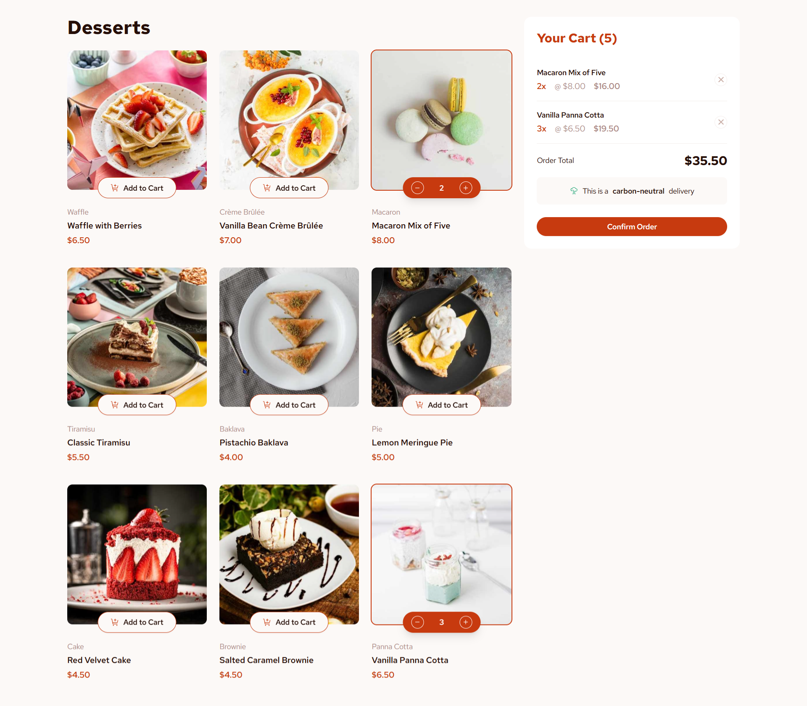
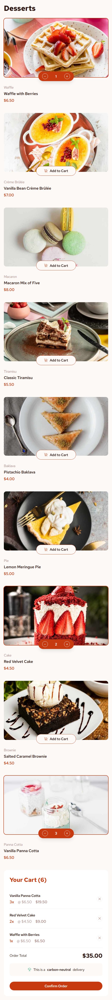

# Frontend Mentor - Product list with cart solution

This is a solution to the [Product list with cart challenge on Frontend Mentor](https://www.frontendmentor.io/challenges/product-list-with-cart-5MmqLVAp_d). Frontend Mentor challenges help you improve your coding skills by building realistic projects.

## Table of contents

- [Overview](#overview)
  - [The challenge](#the-challenge)
  - [Screenshot](#screenshot)
  - [Links](#links)
- [My process](#my-process)
  - [Built with](#built-with)
  - [What I learned](#what-i-learned)
  - [Continued development](#continued-development)
  - [Useful resources](#useful-resources)
- [Author](#author)

## Overview

### The challenge

Users should be able to:

- Add items to the cart and remove them
- Increase/decrease the number of items in the cart
- See an order confirmation modal when they click "Confirm Order"
- Reset their selections when they click "Start New Order"
- View the optimal layout for the interface depending on their device's screen size
- See hover and focus states for all interactive elements on the page

### Screenshot




### Links

- Solution URL: [Frontend Mentor Solution](https://www.frontendmentor.io/solutions/product-list-with-cart-ztWU9IogKx)
- Live Site URL: [Product List with Cart](https://product-list-with-cart-mavix.netlify.app/)

## My process

### Built with

- [React](https://reactjs.org/) - JS library
- [TypeScript](https://www.typescriptlang.org/) - Type safety
- [Vite](https://vitejs.dev/) - Build tool
- [Tailwind CSS](https://tailwindcss.com/) - CSS framework
- [Radix UI](https://www.radix-ui.com/) - UI primitives
- [Lucide React](https://lucide.dev/) - Icons
- [Class Variance Authority](https://cva.style/) - Component variants
- Mobile-first responsive design
- Semantic HTML5 markup
- CSS custom properties
- Flexbox and CSS Grid

### What I learned

This project helped me strengthen my understanding of several key concepts:

**State Management with React Hooks**

```tsx
const [cart, setCart] = useState<CartItem[]>([]);
const [orderConfirmed, setOrderConfirmed] = useState(false);
```

**TypeScript Integration**

```tsx
interface CartItem extends DessertItem {
  quantity: number;
}

interface CartProps {
  cart: CartItem[];
  onRemoveFromCart: (id: string) => void;
  onConfirmOrder: () => void;
  onStartNewOrder: () => void;
}
```

**Responsive Design with Tailwind CSS**

```tsx
<div className="grid gap-6 lg:grid-cols-3">
  <div className="space-y-6 lg:col-span-2">{/* Desserts Grid */}</div>
  <div className="lg:col-span-1">{/* Cart */}</div>
</div>
```

**Component Composition and Reusability**
Creating reusable UI components like `DessertCard`, `Cart`, and `OrderConfirmation` that can be easily maintained and extended.

**Accessibility and UX**

- Proper focus states and keyboard navigation
- Responsive design that works on all screen sizes
- Clear visual feedback for user interactions
- Modal and sheet components for different screen sizes

### Continued development

Areas I'd like to continue focusing on in future projects:

- **Performance Optimization**: Implementing React.memo, useMemo, and useCallback for better performance
- **Testing**: Adding comprehensive unit and integration tests with Jest and React Testing Library
- **State Management**: Exploring more advanced state management solutions like Zustand or Redux Toolkit
- **Animation**: Adding smooth animations and transitions using Framer Motion
- **Backend Integration**: Connecting to real APIs and handling data persistence

### Useful resources

- [React Documentation](https://react.dev/) - The official React docs helped me understand hooks and component patterns
- [Tailwind CSS Documentation](https://tailwindcss.com/docs) - Essential for building responsive layouts efficiently
- [Radix UI Documentation](https://www.radix-ui.com/docs) - Great resource for accessible UI primitives
- [TypeScript Handbook](https://www.typescriptlang.org/docs/) - Helped me implement proper type safety
- [Frontend Mentor Community](https://www.frontendmentor.io/community) - Great place to get feedback and learn from others

## Author

- Frontend Mentor - [@mavix21](https://www.frontendmentor.io/profile/mavix21)
- GitHub - [@mavix21](https://github.com/mavix21)
- LinkedIn - [Marcelo Vizcarra](https://www.linkedin.com/in/marcelo-vizcarra-7459841b1/)

---

This project was built as part of the Frontend Mentor challenges to improve my coding skills and build realistic projects.
